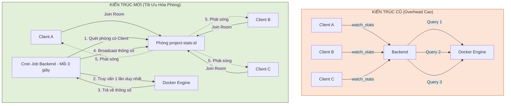
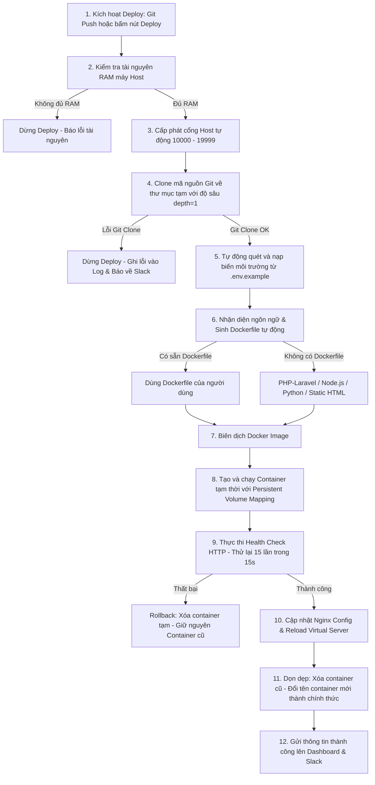

# BÁO CÁO TIẾN ĐỘ DỰ ÁN POTATO (INTERNAL DEVELOPER PLATFORM - IDP)
**Thời gian báo cáo:** Từ 01/06/2026 đến 11/06/2026 (Giai đoạn chạy nước rút hoàn thiện hạ tầng và chuẩn bị báo cáo Luận văn)
**Thành viên thực hiện:** Minh Duy
**Dự án:** Potato (Nền tảng hỗ trợ nhà phát triển triển khai ứng dụng nội bộ - IDP)

---

## 1. Tóm Tắt Tiến Độ Trong Giai Đoạn (01/06 - 11/06)
Trong 10 ngày qua, dự án đã tập trung tối đa vào việc **giải quyết các lỗi môi trường hệ điều hành Windows**, **tối ưu hóa tài nguyên đĩa cứng/cổng kết nối**, **đồng bộ hóa trạng thái thực tế của hệ thống** và **chuẩn bị tài liệu báo cáo luận văn**. 

Các đầu việc chính đã hoàn thành bao gồm:
1. **Khắc phục lỗi kết nối chéo trên Windows (IPv6 Localhost Bypass):** Sửa lỗi Frontend Next.js không thể kết nối tới Backend NestJS do lỗi phân giải DNS IPv6 (`localhost` sang `::1`) trên môi trường Windows.
2. **Nâng cấp cấp phát cổng an toàn 3 lớp (3-Layer Port Allocation):** Chống kẹt cổng máy Host khi gán cổng cho Container bằng cách kiểm tra đồng thời ở (1) Database web, (2) Docker Daemon, và (3) Test socket vật lý bằng `net.createServer()`.
3. **Tự động dọn rác Image & Cache biên dịch (Garbage Collection):** Xóa các Docker Image phiên bản cũ và chạy lệnh `prune` dọn build cache ngay sau khi deploy thành công để giải quyết triệt để vấn đề phình dung lượng SSD máy chủ.
4. **Tự động đồng bộ trạng thái thực tế Database (Lazy Status Sync):** Đồng bộ trạng thái từ Docker Daemon về cơ sở dữ liệu web khi người dùng mở trang danh sách, giải quyết triệt để lỗi lệch trạng thái (State Drift) khi database bị xóa ngoài hệ thống.
5. **Dọn dẹp và thu hồi tài nguyên kẹt:** Tiến hành xóa bỏ hơn 17 container database và dự án test cũ bị chạy thừa hoặc kẹt trên Docker của máy phát triển.
6. **Khắc phục lỗi Next.js watcher crash:** Giải quyết triệt để lỗi khóa tiến trình (file lock) khi xóa thư mục `.next` lúc server đang chạy, giúp khôi phục môi trường chạy dev mượt mà.
7. **Biên soạn và đơn giản hóa tài liệu tính năng:** Viết tệp [DANH_SACH_TINH_NANG.md](file:///C:/Users/minhd/OneDrive/Desktop/Potato/DANH_SACH_TINH_NANG.md) dưới dạng tóm tắt ngắn gọn, dễ hiểu để nộp thầy hướng dẫn duyệt trước.

---

## 2. Chi Tiết Các Tính Năng Đã Hoàn Thành & Tối Ưu

### 2.1. Khắc Phục Lỗi Kết Nối Trên Windows (IPv6 Localhost Fix)
*   **Vấn đề:** Khi chạy trên Windows, trình duyệt mặc định phân giải `localhost` thành địa chỉ IPv6 `::1`, khiến Frontend không thể gọi API Backend (lỗi `Failed to fetch`).
*   **Giải pháp:** Cấu hình lại tệp cấu hình API [api.ts](file:///C:/Users/minhd/OneDrive/Desktop/Potato/fe/lib/api.ts) trên Frontend Next.js để tự động chuyển hướng các kết nối nội bộ sang địa chỉ IPv4 cụ thể `127.0.0.1:3000`. Hệ thống chạy ổn định và phản hồi API tức thời.

### 2.2. Cơ Chế Triển Khai Không Gián Đoạn (Zero-downtime Deployment)
*   **Giải pháp đã chạy ổn định:** Khi có yêu cầu triển khai mới, backend khởi chạy một container tạm trên cổng Host ngẫu nhiên chạy song song với container cũ, thực hiện HTTP Health Check 15 lần trong 15s. Nếu thành công mới cập nhật cấu hình Nginx sang cổng mới bằng `nginx -s reload` (<0.1s, không ngắt kết nối), sau đó mới tắt container cũ.
*   **Cơ chế Auto-Rollback:** Nếu container mới bị crash hoặc không vượt qua Health Check, hệ thống tự động xóa bản mới đi và giữ nguyên bản cũ chạy ổn định.

```mermaid
sequenceDiagram
    autonumber
    participant D as Developer / Git Push
    participant BE as Potato Backend (NestJS)
    participant DK as Docker Engine
    participant NX as Nginx Proxy
    
    D->>BE: Yêu cầu Deploy dự án
    BE->>BE: Build Docker Image từ mã nguồn mới
    BE->>DK: Khởi tạo Container mới (Cổng Host tạm thời)
    BE->>DK: Chạy Container mới
    
    loop Kiểm tra Sức khỏe (Health Check - 15 lần / 15s)
        BE->>DK: Kiểm tra cổng HTTP http://localhost:newPort
        DK-->>BE: Phản hồi (OK / Chưa Sẵn Sàng)
    end
    
    alt Trường hợp 1: Health Check THÀNH CÔNG (Success)
        BE->>NX: Cập nhật cấu hình định tuyến sang Cổng Mới
        NX-->>BE: Reload Nginx thành công
        BE->>DK: Stop và Xóa Container cũ
        BE->>DK: Đổi tên Container mới thành Container chính thức
        BE->>D: Thông báo Deploy Thành Công (Dashboard & Slack)
    else Trường hợp 2: Health Check THẤT BẠI (Fail / Crash)
        BE->>DK: Dọn dẹp & Xóa Container mới
        Note over BE: Giữ nguyên Container cũ đang chạy ổn định
        BE->>D: Cảnh báo Deploy Thất Bại & Rollback thành công
    end
```

### 2.3. Tối Ưu Hóa Truyền Tải Chỉ Số Qua WebSocket Rooms
*   **Giải pháp:** Gom các client đang xem chung đồ thị CPU/RAM của một dự án vào một phòng WebSocket (`project-stats:projectId`). Backend chỉ gọi Docker Engine API lấy thông số 1 lần duy nhất cho mỗi phòng có người xem và phát sóng cho cả phòng. Khi không có ai xem, hệ thống tắt hẳn việc truy vấn Docker để tiết kiệm CPU máy chủ.

### 2.4. Thuật Toán Cấp Phát Cổng Tránh Xung Đột 3 Lớp
*   **Vấn đề:** Đôi khi cổng ngẫu nhiên hệ thống cấp phát bị chiếm bởi các ứng dụng bên ngoài chạy trên máy chủ (như Skype, XAMPP, các container ngoài nền tảng) gây lỗi khởi động.
*   **Giải pháp:** Nâng cấp hàm `allocatePort` trong [projects.service.ts](file:///C:/Users/minhd/OneDrive/Desktop/Potato/be/src/projects/projects.service.ts#L1318) và [databases.service.ts](file:///C:/Users/minhd/OneDrive/Desktop/Potato/be/src/databases/databases.service.ts#L286) để kiểm tra qua 3 lớp bảo mật trước khi gán:
    1.  *Database Check:* Cổng chưa được lưu cấp phát cho dự án/database nào khác trong PostgreSQL.
    2.  *Docker Daemon Check:* Cổng chưa bị chiếm giữ bởi bất kỳ container nào chạy ngoài hệ thống.
    3.  *Physical Socket Check:* Thử tạo một socket ảo bằng `net.createServer()` ngay trên máy Host để đảm bảo hệ điều hành thực sự trống cổng đó.

### 2.5. Tự Động Đồng Bộ Trạng Thái Database (Lazy Status Sync)
*   **Vấn đề:** Người dùng tắt hoặc xóa container database bằng Docker CLI bên ngoài, nhưng trên trang web vẫn hiển thị trạng thái `running`, gây lỗi khi tương tác.
*   **Giải pháp:** Viết logic đồng bộ vào API lấy danh sách database [databases.service.ts](file:///C:/Users/minhd/OneDrive/Desktop/Potato/be/src/databases/databases.service.ts#L34). Khi trang web tải danh sách cơ sở dữ liệu, backend tự động kiểm tra Docker Daemon. Nếu phát hiện container đã bị xóa bên ngoài, hệ thống sẽ tự động cập nhật trạng thái trong database thành `stopped`.

### 2.6. Tự Động Dọn Dẹp Image & Tránh Phình Ổ Đĩa (Garbage Collection)
*   **Vấn đề:** Mỗi lần deploy lại ứng dụng, Docker build sinh ra một image mới. Các image phiên bản cũ và build cache tích tụ làm đầy đĩa cứng của máy chủ.
*   **Giải pháp:** Tích hợp logic dọn dẹp vào luồng deploy trong [projects.service.ts](file:///C:/Users/minhd/OneDrive/Desktop/Potato/be/src/projects/projects.service.ts#L1188). Ngay sau khi container mới hoạt động ổn định, backend tự tìm và xóa các image phiên bản cũ (`dep-X` cũ) của dự án đó, đồng thời chạy lệnh `docker image prune -f` để dọn sạch build cache dư thừa.

### 2.7. Tự Động Co Giãn RAM/CPU Trực Tiếp (Hot Auto-scaling)
*   **Giải pháp:** Tích hợp logic co giãn tài nguyên trong [stats-collector.service.ts](file:///C:/Users/minhd/OneDrive/Desktop/Potato/be/src/projects/stats-collector.service.ts#L47):
    *   *Scale Up:* Tự động tăng thêm RAM (+256MB) và CPU (+0.5 core) khi CPU load của container vượt ngưỡng 80% liên tục.
    *   *Scale Down:* Tự động giảm RAM (-256MB) và CPU (-0.5 core) khi CPU load dưới ngưỡng 15% liên tục để nhường tài nguyên cho máy Host.
    *   Cập nhật trực tiếp tài nguyên qua Docker API (`container.update()`) không cần restart container.

---

## 3. Kịch Bản Khởi Chạy Và Triển Khai Mã Nguồn (CI/CD Pipeline Sequence)

Dưới đây là kịch bản chi tiết mô tả luồng thực thi khi mã nguồn được đẩy lên hệ thống Potato:

---

## 4. Kế Hoạch Cho Tuần Tiếp Theo
1.  **Nghiên cứu tích hợp Let's Encrypt:** Thử nghiệm tự động cấp chứng chỉ SSL chính thức (thay cho chứng chỉ tự ký).
2.  **Tích hợp Docker Event Listener:** Chuyển đổi cơ chế Lazy Sync sang cơ chế lắng nghe sự kiện của Docker (`docker.getEvents()`) để cập nhật trạng thái ứng dụng thời gian thực ngay khi container thay đổi ngoài hệ thống.
3.  **Tách biệt Control Plane & Data Plane (Thiết kế lý thuyết):** Xây dựng mô hình thiết kế hệ thống phân tán để trình bày trong slide báo cáo luận văn.

---

## 5. Khó Khăn Đã Giải Quyết (Troubleshooting Log)
*   **Lỗi nghẽn dev server Next.js:** Khóa tiến trình và crash cổng `3001` do file lock khi xóa thư mục `.next`. -> *Giải pháp:* Đã tắt cưỡng bức tiến trình kẹt, dọn dẹp cache và khởi động lại sạch sẽ.
*   **Lỗi không gọi được API trên Windows:** Trình duyệt gọi qua `localhost` bị ép về IPv6 `::1`. -> *Giải pháp:* Chuyển sang kết nối IP tĩnh `127.0.0.1`.
*   **Đầy ổ cứng máy chủ:** Docker build tích tụ image rác. -> *Giải pháp:* Tích hợp cơ chế tự động Prune image cũ ngay sau deploy.
